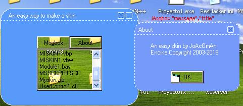

<div align="center">

## An easy way to do a transparate control and a skin


</div>

### Description

This code is for people who want to make skin in an easy way, and it demonstrate a way to do a custom message box with the Msgbox command (msgbox "the message","the title"). Also, my code teach how to do a transparent control (like commandbutton or textbox or FORM), please rate it good, I take several days searching API'S
 
### More Info
 


<span>             |<span>
---                |---
**Submitted On**   |2003-10-08 18:59:12
**By**             |[Joacorp\.](https://github.com/Planet-Source-Code/PSCIndex/blob/master/ByAuthor/joacorp.md)
**Level**          |Intermediate
**User Rating**    |4.4 (35 globes from 8 users)
**Compatibility**  |VB 6\.0
**Category**       |[Miscellaneous](https://github.com/Planet-Source-Code/PSCIndex/blob/master/ByCategory/miscellaneous__1-1.md)
**World**          |[Visual Basic](https://github.com/Planet-Source-Code/PSCIndex/blob/master/ByWorld/visual-basic.md)
**Archive File**   |[An\_easy\_wa1655681082003\.zip](https://github.com/Planet-Source-Code/joacorp-an-easy-way-to-do-a-transparate-control-and-a-skin__1-49097/archive/master.zip)

### API Declarations

```
Private Declare Function GetWindowLong Lib "user32" Alias "GetWindowLongA" (ByVal hWnd As Long, ByVal nIndex As Long) As Long
Private Declare Function SetWindowLong Lib "user32" Alias "SetWindowLongA" (ByVal hWnd As Long, ByVal nIndex As Long, ByVal dwNewLong As Long) As Long
Private Declare Function ReleaseCapture Lib "user32.dll" () As Long
Private Declare Function SendMessage Lib "user32.dll" Alias "SendMessageA" (ByVal hWnd As Long, ByVal wMsg As Long, ByVal wParam As Long, lParam As Any) As Long
Private Declare Function SetLayeredWindowAttributes Lib "user32.dll" (ByVal hWnd As Long, ByVal crKey As Long, ByVal bAlpha As Byte, ByVal dwFlags As Long) As Long
```


